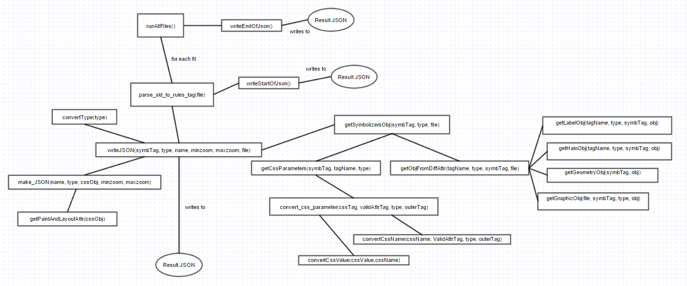
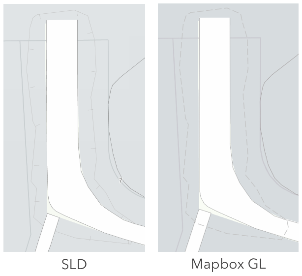

#  Konvertering fra SLD til Mapbox GL
## Kodedokumentasjon for: `SLD_to_JSON.js`

`SLD_to_JSON.js` is a script for converting FKB-data in SLD-format to the Mapbox GL style specification.  
The SLD-format is an XML-schema for describing the appearance of map layers, while the Mapbox GL specification is a JSON schema.

The script is not a complete SLD to Mapbox GL converter, but it is supports the files we had that needed to be converted. Therefor there might be attributes in the SLD standard that is not supported, simply because it wasn't in any if the files we needed to convert.

## Innhold
1. [The Mapbox GL specification](#The Mapbox GL specification)
2. [The SLD-files and the conversion](#The SLD-files and the conversion)
3. [Layout of the code](#Layout of the code)
4. [Result and manual changes](#Result and manual changes)
5. [Unsolved problems](#Unsolved problems)
6. [Running the code](#Running the code)
7. [Useful links](#Useful links)

<a name="The Mapbox GL specification"</a>
## The Mapbox GL specification
Example of valid Mapbox GL format:

```json
{
  "id": "fill-FKB_ArealressursFlate_bebyggelse",
  "layout": {},
  "source": "norkart",
  "source-layer": "FKB_ArealressursFlate_bebyggelse",
  "minzoom": 13,
  "maxzoom": 22,
  "type": "fill",
  "paint": {
    "fill-color": "#d7dcdf"
  }
},
{
  "id": "line-FKB_ArealressursFlate_bebyggelse",
  "layout": {},
  "source": "norkart",
  "source-layer": "FKB_ArealressursFlate_bebyggelse",
  "minzoom": 16,
  "maxzoom": 22,
  "type": "line",
  "paint": {
    "line-color": "#d7dcdf",
    "line-width": 0.1
  }
}
```

- Id is a *unique* identificator for the layer
-	Type describes if it is a polygon (fill), line, text(symbol) or point(symbol)  
-	Source-layer refers to the vector tile layer-id
-	Minzoom and maxzoom defines what zoom level the style is visible
-	"paint» and "layout» are objects with different attributes that describes how the layer is drawn/how it will look

<a name="The SLD-files and the conversion"</a>
## The SLD-files and the conversion


To get the paint and layout attributes I used the part of the XML-schema that was within the 'rules' tag, and their valid inner tags:
- **LineSymbolizer**, **TextSymbolizer**,**PolygonSymbolizer** and **PointSymbolizer**.

I used xml2js.Parser() to read the XML. The disadvantage of this was that I could not look up directly the tag name, but had to iterate through the structure until the correct tag was found. This made the code less readable, had to learn how the layout for all the different versions of the SLD could be, to know where the tags could be found.

#### Mapping from attribute name in SLD to Mapbox GL:
The Xml-files, has as mentioned above, relevant info in a symbolizer-tag, that defines the "type"-attribute in Mapbox GL.

The translation from symbolizer to type is:

SLD symbolizer | Mapbox type
---|---
LineSymbolizer|line
PolygonSymbolizer|fill
TextSymbolizer|symbol
PointSymbolizer|symbol

Each of these has an inner tag that defines attributes that contains the "cssParameter"-tags. A lot of these could be converted directly from the css parameter name ("CssParameter name= "…" "):

SLD attribute | Mapbox attribute
---|---
stroke|line-color
stroke-width|line-width
stroke-dasharray|line-dasharray
stroke-linejoin|line-join
opacity|line-opacity
font-size|text-size
font-family|text-font

Other translations was dependent on the parent tag.

SLD attribute | Mapbox attribute
---|---
PolygonSymbolizer-Fill-fill | fill-color
PolygonSymbolizer-Fill-fill-opacity| fill-opacity
PolygonSymbolizer-Fill-opacity|fill-opacity
Label|text-field
TextSymbolizer-Halo-Fill-fill|text-halo-color
TextSymbolizer-Fill-fill|text-color

Some of the attributes i did not find a translation for:
-	Font-style (could be added through text-font by adding bold after name of the font)
-	Font-weight


#### Attribute values:
An important part of the code was to extract the attribute values. I wrote a general method for this: `getCssParameters(symbTag, validAttrTag, type, outerTag)`. This method returns an array with attribute names and attribute values.

The method is written based on the structure i could find in most of the SLD files I had. These files had the attribute information i a css-parameter-tagg, within a symbolizer-tag with an inner tag that defined the type, example `<stroke>` or `<fill>`.

```xml
<LineSymbolizer>
  <Stroke>
    <CssParameter name="stroke">
      #<ogc:Function name="env">
        <ogc:Literal>bbg</ogc:Literal>
        <ogc:Literal>87bef1</ogc:Literal>
      </ogc:Function>
    </CssParameter>
    <CssParameter name="stroke-width">0.1</CssParameter>
  </Stroke>
</LineSymbolizer>
```

Fill, stroke and opacity had the same layout as you can see above, where the attribute value is in the other `<ogc:literal>` tag.

Other then this, the rest of the attributes had their values directly in the css-parameter-tag, as with you can se with for example stroke-width.

Even though most of the files had layout like this, it did not apply for all attributes, or all cases of each attribute.
An example is the code underneath, that shows an example where the layout is very different.

```xml
<TextSymbolizer>
  <Label>
    <ogc:PropertyName>gatenavn</ogc:PropertyName>
  </Label>
  <Halo>
    <Radius>
      <ogc:Literal>1.5</ogc:Literal>
    </Radius>
```

To handle these exceptions, i made the method `getObjFromDiffAttr()`. Here I wrote completely separate methods for the exceptions.

<a name="Layout of the code"></a>
## Layout of the code




<a name="Order of the layers"></a>
## Order of the layers

In Mapbox GL the layers are drawn in the order they are defined in the JSON file. This order has to be defined manually after the creation of the JSON file. Therefor a script was created to reorder the layers. The file `layers_ordering.txt`, contains a list with the id-names for the layers, where the names are written in the order they should be drawn. By running the code `create_rightOrder.js` the layers in the input file are sorted in the same order as they are defined in `layers_ordering.txt`.

One thing that was important, but not obvious (at least to me), was that the lines to the polygons always had to be drawn before the polygon itself. The reason is that the polygons overlap the lines, and parts of the lines are therefore hidden behind the polygon. This made it seem like the rendering of the lines were bad because they were hidden behind the polygon, which has poor rendering on the sides.

<a name="Result and manual changes"></a>
## Result and manual changes

The goal of the script was to get a map which was equivalent to the map located on 1881.no now. For the most parts it worked well, and translation worked well. Still, some parts of the SLD was not translated or did not worked optimally and therefore required manual changes after the conversion.

<a name="stops"></a>
#### "Stops" attribute

An important attribute in Mapbox GL, which was added to a lot of the layers and attributes manually afterwards, were 'stops'. Mapbox defines "Stops" as:

*The value for any layout or paint property may be specified as a function, allowing you to parameterize the value according to the current zoom level. Functions are written as an array of stops, where each stop is an array with two elements: a zoom level and a corresponding value. Stops must be in ascending zoom order.*

*Some properties support interpolated functions. The result of an interpolated function is an interpolated value between the last stop whose zoom level is less than or equal to the current zoom level, and the next stop. By default, linear interpolation is used, but you can use a different exponential base for the interpolation curve via the base property. If the current zoom is less than the first stop or greater than the last stop, the result is the value from the first or last stop respectively.*

*For properties that do not support interpolated functions, the result is the value of the last stop whose zoom value is less than or equal to the current zoom level.*

```json
{
    "line-width": {
        "base": 1.5,
        "stops": [[5, 1], [7, 2], [11, 3]]
    }
}
```

*base: Optional number. Default is 1.
The exponential base of the interpolation curve. It controls the rate at which the result increases. Higher values make the result increase more towards the high end of the range. With values close to 1 the result increases linearly.*

*stops: Required array.
An array of zoom level and value pairs. The value can be a number or a color value for color properties.*

#### Extra layers
 Something that was missing in the SLD files, and that I could not find anywhere, was border lines on some of the buildings. Therefore I had to manually create som layers afterwards, and the id of these were:
- line-FKB_Bygning_1
- line-FKB_Bygning_2
- line-FKB_Bygning_3
- line-FKB_AnnenBygning_1
- line-FKB_AnnenBygning_2
- line-FKB_AnnenBygning_3

In addition to the shadow files that were translated directly, I also made some extra shadow layers by drawing an additional building-polygon with offset and opacity value. The good thing about drawing shadow in this way is that you can choose the direction of the shadow and you can resize depending on zoom level by using the [ "stop" -attribute] (# stop).

<a name="Unsolved problems"></a>
## Unsolved problems

I was not able to find how to draw Depression curves in the correct way.
The photo the the left shows how it should have been drawn, and is drawn in SLD, while the photo to the right shows how it is drawn in Mapbox GL. It could be possible to solve this by using "line-image" in Mapbox GL.



Even when symbols are placed in the end of the JSON file, and should be drawn on top of everything else, some of the symbols are still hidden behind other elements. As far as I can tell, it is solved by adding `icon-allow-overlap:true` to the layers in question. An improvement to the script could be to add this automatically to all symbol layers, but this could maybe have an unwanted effect to some symbols.

Icons are not added to all layers of type **symbol**, and not images that should fill polyongs,`fill-image`, since I was not sure what icons should be used. Mapbox do have sprite sheets available, but they do not cover everything.


<a name="Running the code"></a>

## Running the code
When downloading the code, remember to run `npm install` to install dependencies.

When running the code you can choose to either convert one file, or to convert all files in a give folder. This is dependent on if you are running
`parseAllFiles()`, or just `parse_sld_to_rules_tag()`. You also need to fill in some specific fields, and the instruction for this is added in the script.

When the script is finished, to files are created; `Result.JSON` and `errorFiles.txt`. `Result.JSON` is the result of the convertion, and the  `errorFiles.txt` is a file with a list over files that could not be converted, if any.

<a name="Useful links"></a>
## Useful links
Mapbox GL style specification:
https://www.mapbox.com/mapbox-gl-style-spec/

Mapbox GL validator: https://github.com/mapbox/mapbox-gl-style-spec/blob/mb-pages/README.md#validation

SLD specification: http://docs.geoserver.org/latest/en/user/styling/sld-cookbook/index.html#sld-cookbook

# --

#### Written by: Mathilde Ørstavik, summer intern 2015.
